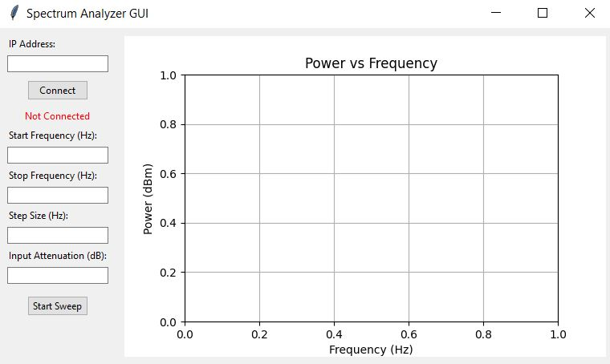

# Keysight N9340B Spectrum Analyzer  
This Python-based GUI tool provides an interface to communicate with the Keysight N9340B Handheld Spectrum Analyzer. It allows real-time communication with the instrument and displays measurement data on interactive plots directly within the GUI. The connection between the device and the pc occurs through ethernet port. You need to enter the IP address of the spectrum and start connection with the device. Once, the device is connected, you can set start and stop frequency, step size, and input attentuion of the port. Then,you can hit start sweep button to capture the readings and display it in the gui plot. 

# Features:
- Connect to the spectrum analyzer using its IP address

- Configure measurement parameters:

  o Start frequency
  
  o Stop frequency
  
  o Frequency step size
  
  o Input attenuation

- Perform frequency sweeps with the Start Sweep button

- Display readings on interactive plots embedded in the GUI

# libraries:

- Tkinter version: 8.6

- Matplotlib version: 3.10.0

- NumPy version: 2.2.1

- vxi11 version: 0.9

# GUI Screenshot:

 
